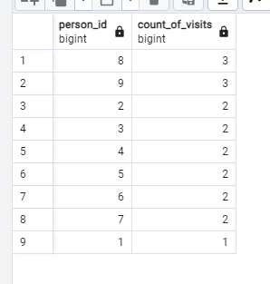
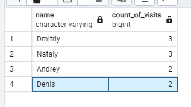
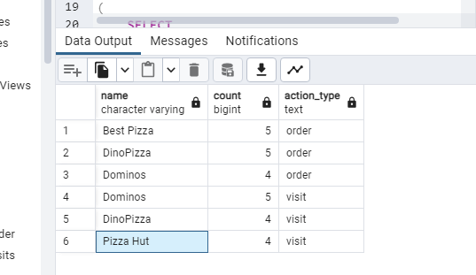
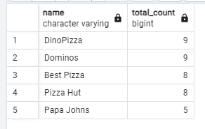
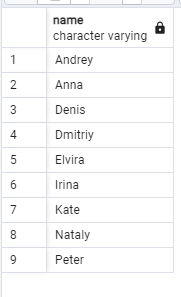
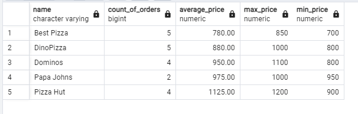
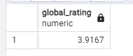
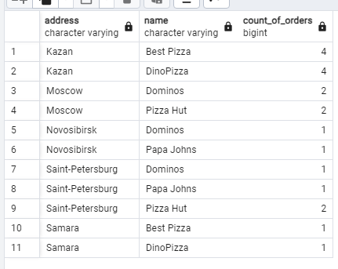
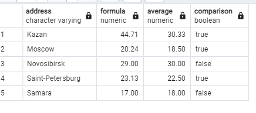

## Chapter IV
## Exercise 00 - Simple aggregated information
Let’s make a simple aggregation, please write a SQL statement that returns person identifiers and corresponding number of visits in any pizzerias and sorting by count of visits in descending mode and sorting in `person_id` in ascending mode. Please take a look at the sample of data below.

```sql
Select 
person_id, 
COUNT(*) AS count_of_visits
From person_visits
Group by person_id
Order by count_of_visits DESC,
person_id ASC
```



## Chapter V
## Exercise 01 - Let’s see real names

Please change a SQL statement from Exercise 00 and return a person name (not identifier). Additional clause is  we need to see only top-4 persons with maximal visits in any pizzerias and sorted by a person name. Please take a look at the example of output data below.

| name | count_of_visits |
| ------ | ------ |
| Dmitriy | 4 |
| Denis | 3 |
| ... | ... |


```sql
select p.name,
count(pv.id) as count_of_visits
from person_visits pv
join person p on pv.person_id = p.id
group by
p.name
order by
count_of_visits desc,
p.name asc
limit 4;
```



## Chapter VI
## Exercise 02 - Restaurants statistics

Please write a SQL statement to see 3 favorite restaurants by visits and by orders in one list (please add an action_type column with values ‘order’ or ‘visit’, it depends on data from the corresponding table). Please take a look at the sample of data below. The result should be sorted by action_type column in ascending mode and by count column in descending mode.

| name | count | action_type |
| ------ | ------ | ------ |
| Dominos | 6 | order |
| ... | ... | ... |
| Dominos | 7 | visit |
| ... | ... | ... |

```sql
(
    SELECT 
        pz.name,
        COUNT(*) AS count,
        'order' AS action_type
    FROM 
        person_order po
    JOIN 
        pizzeria pz ON po.menu_id IN (
            SELECT id FROM menu WHERE pizzeria_id = pz.id
        )
    GROUP BY 
        pz.name
    ORDER BY 
        count DESC
    LIMIT 3
)
UNION ALL
(
    SELECT 
        pz.name,
        COUNT(*) AS count,
        'visit' AS action_type
    FROM 
        person_visits pv
    JOIN 
        pizzeria pz ON pv.pizzeria_id = pz.id
    GROUP BY 
        pz.name
    ORDER BY 
        count DESC
    LIMIT 3
)
ORDER BY 
    action_type ASC,
    count DESC;
```


## Chapter VII
## Exercise 03 - Restaurants statistics #2


Please write a SQL statement to see restaurants are grouping by visits and by orders and joined with each other by using restaurant name.  
You can use internal SQLs from Exercise 02 (restaurants by visits and by orders) without limitations of amount of rows.

Additionally, please add the next rules.
- calculate a sum of orders and visits for corresponding pizzeria (be aware, not all pizzeria keys are presented in both tables).
- sort results by `total_count` column in descending mode and by `name` in ascending mode.
Take a look at the data sample below.

| name | total_count |
| ------ | ------ |
| Dominos | 13 |
| DinoPizza | 9 |
| ... | ... | 

 ```sql
SELECT 
    COALESCE(v.name, o.name) AS name,
    COALESCE(v.visit_count, 0) + COALESCE(o.order_count, 0) AS total_count
FROM 
    (SELECT 
        pz.name,
        COUNT(*) AS visit_count
     FROM 
        person_visits pv
     JOIN 
        pizzeria pz ON pv.pizzeria_id = pz.id
     GROUP BY 
        pz.name) v
FULL OUTER JOIN
    (SELECT 
        pz.name,
        COUNT(*) AS order_count
     FROM 
        person_order po
     JOIN 
        menu m ON po.menu_id = m.id
     JOIN 
        pizzeria pz ON m.pizzeria_id = pz.id
     GROUP BY 
        pz.name) o
ON v.name = o.name
ORDER BY 
    total_count DESC,
    name ASC;
```


## Chapter VIII
## Exercise 04 - Clause for groups
Please write a SQL statement that returns the person name and corresponding number of visits in any pizzerias if the person has visited more than 3 times (> 3).Please take a look at the sample of data below.

| name | count_of_visits |
| ------ | ------ |
| Dmitriy | 4 |

```sql
SELECT 
    p.name,
    COUNT(pv.id) AS count_of_visits
FROM 
    person_visits pv
JOIN 
    person p ON pv.person_id = p.id
GROUP BY 
    p.name
HAVING 
    COUNT(pv.id) > 3
ORDER BY 
    count_of_visits DESC,
    p.name ASC;
```


## Chapter IX
## Exercise 05 - Person's uniqueness

Please write a simple SQL query that returns a list of unique person names who made orders in any pizzerias. The result should be sorted by person name. Please take a look at the sample below.

| name | 
| ------ |
| Andrey |
| Anna | 
| ... |

```sql
SELECT DISTINCT
    p.name
FROM 
    person_order po
JOIN 
    person p ON po.person_id = p.id
ORDER BY 
    p.name ASC;
```


## Chapter X
## Exercise 06 - Restaurant metrics

Please write a SQL statement that returns the amount of orders, average of price, maximum and minimum prices for sold pizza by corresponding pizzeria restaurant. The result should be sorted by pizzeria name. Please take a look at the data sample below. 
Round your average price to 2 floating numbers.

| name | count_of_orders | average_price | max_price | min_price |
| ------ | ------ | ------ | ------ | ------ |
| Best Pizza | 5 | 780 | 850 | 700 |
| DinoPizza | 5 | 880 | 1000 | 800 |
| ... | ... | ... | ... | ... |

```sql
SELECT 
    pz.name,
    COUNT(po.id) AS count_of_orders,
    ROUND(AVG(m.price), 2) AS average_price,
    MAX(m.price) AS max_price,
    MIN(m.price) AS min_price
FROM 
    pizzeria pz
JOIN 
    menu m ON pz.id = m.pizzeria_id
JOIN 
    person_order po ON m.id = po.menu_id
GROUP BY 
    pz.name
ORDER BY 
    pz.name ASC;
```


## Chapter XI
## Exercise 07 - Average global rating

Please write a SQL statement that returns a common average rating (the output attribute name is global_rating) for all restaurants. Round your average rating to 4 floating numbers.

```sql
select 
round(avg(rating), 4) as
global_rating
from
pizzeria
```



## Chapter XII
## Exercise 08 - Find pizzeria’s restaurant locations

We know about personal addresses from our data. Let’s imagine, that particular person visits pizzerias in his/her city only. Please write a SQL statement that returns address, pizzeria name and amount of persons’ orders. The result should be sorted by address and then by restaurant name. Please take a look at the sample of output data below.

| address | name |count_of_orders |
| ------ | ------ |------ |
| Kazan | Best Pizza |4 |
| Kazan | DinoPizza |4 |
| ... | ... | ... | 

```sql
SELECT DISTINCT
    p.address,
    pz.name,
    COUNT(po.id) AS count_of_orders
FROM
    person p
    JOIN person_order po ON p.id = po.person_id
    JOIN menu m ON po.menu_id = m.id
    JOIN pizzeria pz ON m.pizzeria_id = pz.id
GROUP BY
    p.address,
    pz.name
ORDER BY p.address, pz.name;
```



## Chapter XIII
## Exercise 09 - Explicit type transformation


Please write a SQL statement that returns aggregated information by person’s address , the result of “Maximal Age - (Minimal Age  / Maximal Age)” that is presented as a formula column, next one is average age per address and the result of comparison between formula and average columns (other words, if formula is greater than  average then True, otherwise False value).

The result should be sorted by address column. Please take a look at the sample of output data below.

| address | formula |average | comparison |
| ------ | ------ |------ |------ |
| Kazan | 44.71 |30.33 | true |
| Moscow | 20.24 | 18.5 | true |
| ... | ... | ... | ... |
 
```sql
SELECT
    p.address,
    ROUND(
        MAX(p.age) - (
            MIN(p.age) / MAX(p.age::NUMERIC)
        ),
        2
    ) AS formula,
    ROUND(AVG(p.age), 2) AS average,
    CASE
        WHEN MAX(p.age) - (MIN(p.age) / MAX(p.age)) > AVG(p.age) THEN TRUE
        ELSE FALSE
    END AS comparison
FROM person p
GROUP BY
    p.address
ORDER BY p.address;
```

